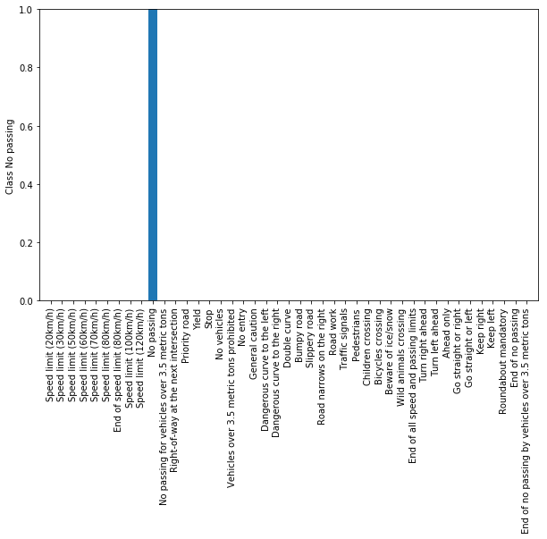
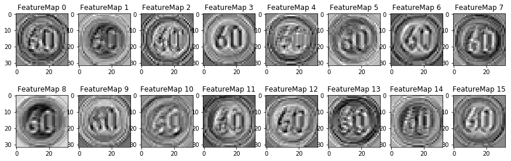

# Data Set Summary & Exploration

## 1. Basic summary of the data set. 
I used numpy to calculate summary statistics of the traffic signs data set:
* The size of the training set is (34799, 32, 32, 3)
* The size of the validation set is (4410, 32, 32, 3)
* The size of the testing set is (12630, 32, 32, 3)
* The shape of a traffic sign image is (32, 32, 3)
* The number of unique classes/labels in the data set is 43.

## 2. Visualization of the dataset.
I first looked at random samples of each class to get a better understanding of the data. For each class, I took 10 samples and displayed them. This allowed me to have a qualitative familiarity with the dataset.

The ten samples from the class 'Speed limit (50km/h) is shown below. For samples of all the classes, please see the attached html files.

I looked at the distribution of labels in the training, validation and test sets. The distributions of the training, validation and test sets are shown below.

# Design and Test a Model Architecture

## 1. Preprocessing Techniques.

I used two techniques for preprocessing.
1. The first technique I used is to normalize the image values to the range [0, 1].

	Normalization of input is important for the performance of convolutions
	and other processing units. 
2. I decided not to convert the image into greyscale as I wanted to explore how the network handles colored images and I was hoping if there are certain patterns which are augmented by color, the network can learn those.
3. The second technique is image augmentation. In image augmentation, for each class, I picked a random sample of 200 images and then generated 10 augmentations for each of the image. This technique was crucial for pushing the accuracy of my model beyond 94%. It helped increase the accuracy to 96.2%. Augmentations of the image include rotation, translation, shear and brightness. Here are examples of images generated from augmenting an image for speed limit 20kmph.

## 2. Model Architecture

For the basic architecture, I considered several variations of the Lenet architecture before iterating on the one I describe below. In contrast to the basic Lenet architecture my model had the following differences
	* Used drop out units after the two fully connected layers to reduce over fitting.
	* Used an additional convolutional layer. The idea was to train a bigger network which first overfits the training set and then use dropout and pooling to regularize.
	* To enable me to use an additional layer easily, I used the 'same' padding option in contrast to the 'valid' padding option in Lenet.
	* I used much wider FC layers than Lenet to allow the model to fit the training set well.
	
Layer | Description
------------ | -------------
Input | 32x32x3 RGB image
Convolution 5x5 | 1x1 stride, same padding, outputs 32x32x16
Max Pooling | 2x2 stride, outputs 16x16x16
Convolution 5x5 | 1x1 stride, same padding, outputs 16x16x32
Max Pooling | 2x2 stride, outputs 8x8x32
Convolution 5x5 | 1x1 stride, same padding, outputs 8x8x64
Max Pooling | 2x2 stride, outputs 4x4x64
Flatten | outputs 1024
Fully Connected | outputs 512
Dropout | Training keep_prob = 0.4
Fully Connected | outputs 512
Dropout | Training keep_prob = 0.4
Fully Connected | outputs 43

## 3. Model Training
I used the following parameters to train the model
	* Learning Rate - 0.0003
	* Dropout (during training) - 0.4
	* Epochs - 50
	* Batch size - 64

## 4. Imporving Validation accuracy.

The first model I started with was the Lenet model. This was a simple model and I wanted to use that as a baseline. I trained the first model and it gave me a validation accuracy of about 84%. I then thought of making the model more powerful and overfit the data and then use dropout to reduce the overfitting. Towards that, I added one additional layer to Lenet, made the FC layers wider and then added two dropout layers after each of the FC layer. With this architecture I got a validation accuracy of about 94%. I chose Lenet because of its simplicity and regular structure and believed that we could build powerful models by adding more layers.

At that point I added augmentation where I sampled 200 images for each class and then generated 10 augmentations of each. I added 2000 images/class to the training set and trained on the augmented training set. This pushed the validation accuracy above 96%. However, these are just the final results. For each configuration I experimented with a lot of values of learning rate and drop out. I tried dropout in the range [0.4, 0.9] and learning rates in the range [0.0001 to 0.002]. 

**My final model results were:**

* training set accuracy of 99.6%
* validation set accuracy of 96.2%
* test set accuracy of 94.1%
	
Overall the high validation accuracy suggests that the model is doing quite welland is not overfitting. The test accuracy could be a bit higher. More augmentation of classes for which we have fewer data can help. There is scope for improvement though and for future work, the model proposed by Yann Lecun with skip connections can be used.

Here are the training and validation accuracy as a function of epoch.

## 4. Testing Model on New Images

Here are five German traffic signs that I found on the web:

I tried to test on different classes of images. The slippery image and the bumpy image are similar and might be difficult to distinguish. The model was able to predict all of them correctly with an accuracy of 100%, giving a lot of confidence in the model.

Here are the plot of the predicted probabilities for the test images.

For all but the last image, the model predicts with almost full certainty the correct class of the image. For the speed 60 case, the model also has slight probability on the speed 30 limit (prob=0.1), compared to the speed 60 case (0.9). 

## 5. Visualization

I implemented the visualization section and visualized the output of one of the conv layers (conv2d). The feature map for this layer shows that the model is focused on identifying the circle within which the 60 is written ans also the contours of the 6 and 0. The visualization is shown below.

